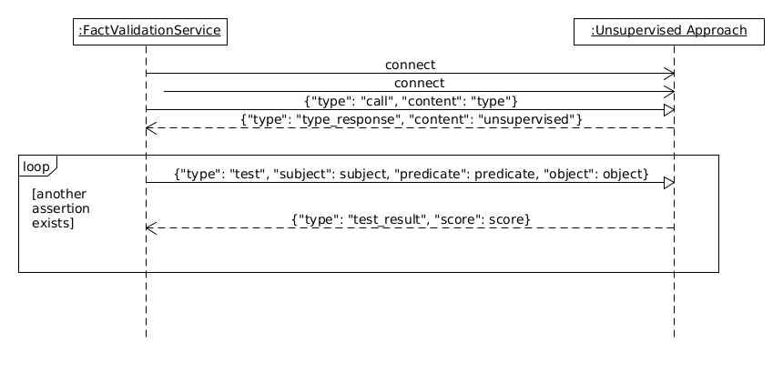
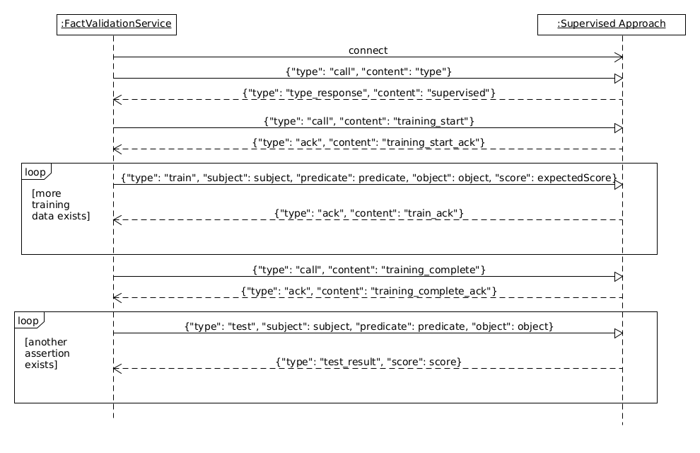

# FactValidationService
The service is used to validate a list of facts on multiple fact validation algorithms.
The algorithms are executed in different processes, which are connected through a TCP interface.

## Interface
The interface differs for supervised and unsupervised approaches.

### Unsupervised

### Supervised
There are two options for communication with supervised approaches. Some need the entire test set before they can validate facts. This is accounted for in the second option.

## Fact Validation Algorithms
Implementations that support this interface are:

* <https://github.com/saschaTrippel/knowledgestream> offers multiple algorithms
* <https://github.com/palaniappan1/COPAAL> offers COPAAL
