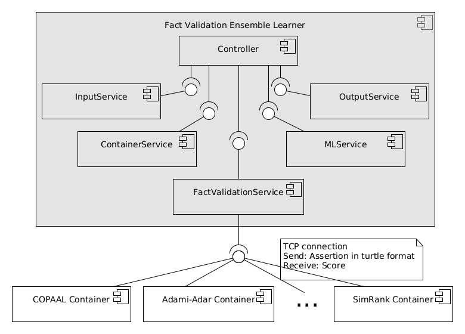

FAVEL
=
<i>Fact Validation Ensemble Learner</i>

# How to run

```
python3 Favel.py [options]
```

## Options
+ ```-d DATA, --data DATA``` path to the dataset to validate
* ```-c, --cache``` Check the cache for correctness

## Optional ContainerService
  ```-sc, --containers``` 
+ To be added next to [options]
+ To Start/Stop containers, if not already running on VM

# Architecture

